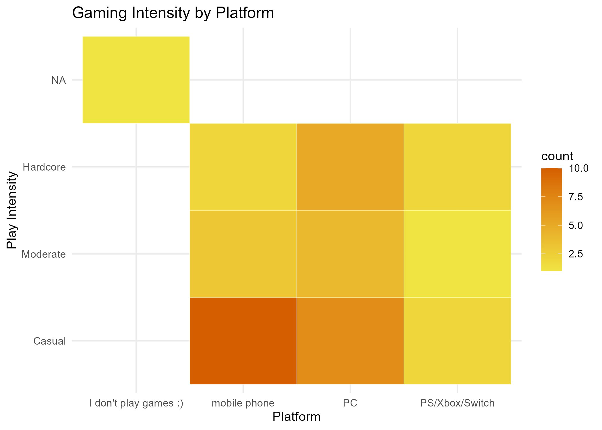

```{css echo=FALSE}
body {
  background-color: #f9f9f9;
  font-family: "Helvetica Neue", sans-serif;
}
h2 {
  color: #2c3e50;
}
```{r setup, include=FALSE}
knitr::opts_chunk$set(echo = TRUE)
```

## Data Context

This data was collected through repeated observations over time, noting gaming behavior including time spent playing games and preferred platforms. Data was logged using a structured Google Form, capturing key variables: hours per week, platform, and timestamp.

```{r cars}
summary(cars)
```

## Weekly Logging Timeline


## Gaming Intensity by Platform



## Play Time Distribution


## Average Play Time by Platform

